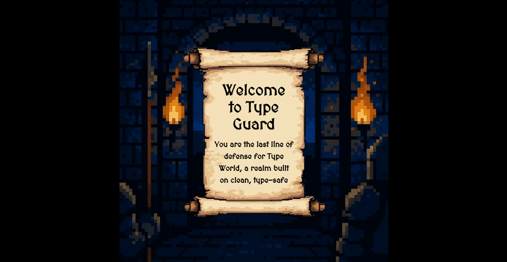

# 🛡️ Type Guard

**A fantasy coding quiz game that protects the world of type scripts**

[](https://choosealicense.com/licenses/mit/)
[](https://nextjs.org/)
[](https://www.convex.dev/)
[](https://www.typescriptlang.org/)

---

## ⚔️ Introduction

https://www.typescriptquiz.com/


## ⚔️ Introduction

Welcome to **Type Guard**!

This is 'Type World', a peaceful realm built upon the strict rules of type safety. However, chaotic forces known as 'Compile Errors' and 'Runtime Errors' have recently invaded, threatening the world's stability.

You are a **Type Guard**, the last line of defense for Type World. Your mission is to inspect the code of visitors and protect the realm. Judge their code: does it adhere to the rules of Type World, or is it dangerous code that will bring chaos? Guard the gates!

## ✨ Features

- **Themed Coding Quizzes on TypeScript**: Solve interactive quizzes covering various syntax and concepts of TypeScript.
- **Pixel Art and Fantasy Concept**: Experience a nostalgic pixel art style combined with a fantasy world setting.
- **Stage and Round System**: Improve your skills step-by-step through a well-structured system of stages and rounds.
- **Dynamic Data Management**: Quiz questions are updated in real-time without redeploying the app, thanks to a CI/CD pipeline using GitHub Actions and On-demand Revalidation.
- **Interactive Problem Solving**: Check and solve problems in an environment similar to a real code editor, powered by the Monaco Editor.

## 🛠️ Tech Stack

- **Frontend**: `Next.js 15` (App Router), `React 19`, `Tailwind CSS`
- **Rendering**: `PixiJS`
- **Backend & Database**: `Convex` (Real-time Backend Platform)
- **State Management**: `Zustand` (Global State), `React Context` (Local/Contextual State)
- **Language**: `TypeScript`
- **CI/CD**: `Vercel` (Deployment), `GitHub Actions` (Data Pipeline)
- **Other Libraries**: `Monaco Editor`, `react-syntax-highlighter`

## 🚀 Getting Started

1. install Dependencies:

```bash
npm install
# or
yarn install
# or
pnpm install
# or
bun install
```

2. Run the Convex Dev Environment:

```bash
npx convex dev
# or
pnpm exec convex dev
# or
bunx convex dev
```

3. Set Up Environment Variables:
   Create a .env.local file in the project root and add the keys issued from Convex and Vercel.

```bash
# .env.local

# Convex Configuration
NEXT_PUBLIC_CONVEX_URL="wss://your-convex-url.convex.cloud"
CONVEX_DEPLOY_KEY="your-convex-deploy-key"

# Revalidation Information
REVALIDATION_SECRET="[Your-strong-secret-token]"
```

4. Import Initial Data (Optional)
   If you have initial quiz data in data/questions.jsonl, run the following command to upload it to your Convex DB.

```bash
# 'quizzes' should be replaced with the actual table name defined in your Convex schema.
npx convex import quizzes data/questions.jsonl
# or
pnpm exec convex import quizzes data/questions.jsonl
# or
bunx convex import quizzes data/questions.jsonl
```

5. Run the Next.js Development Server

```bash
npm run dev
# or
yarn dev
# or
pnpm dev
# or
bun dev
```
